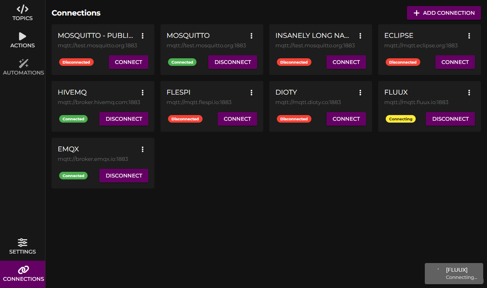
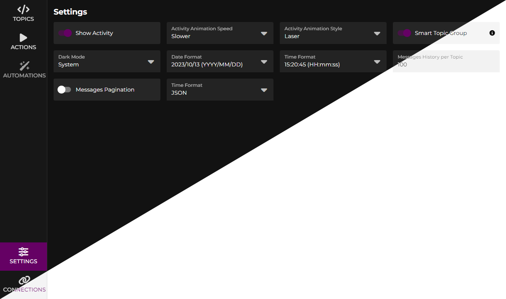
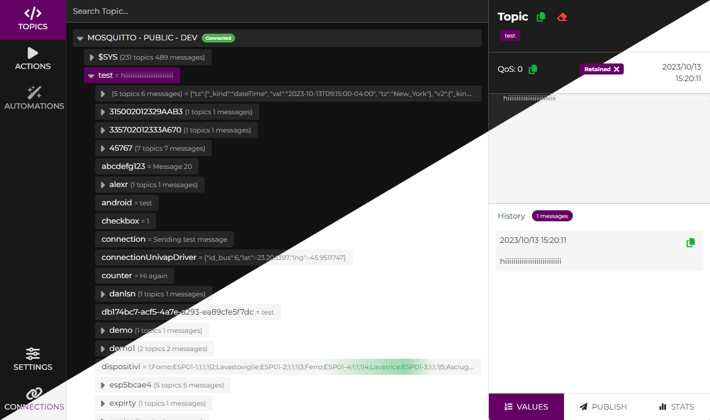
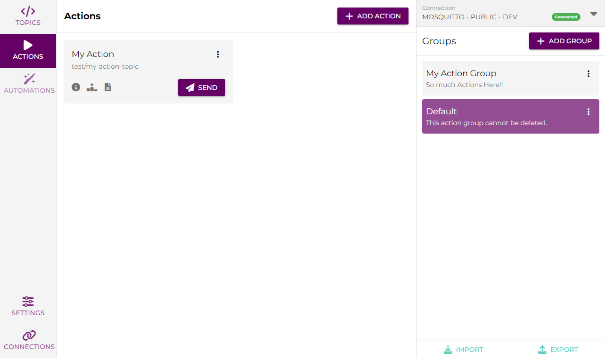
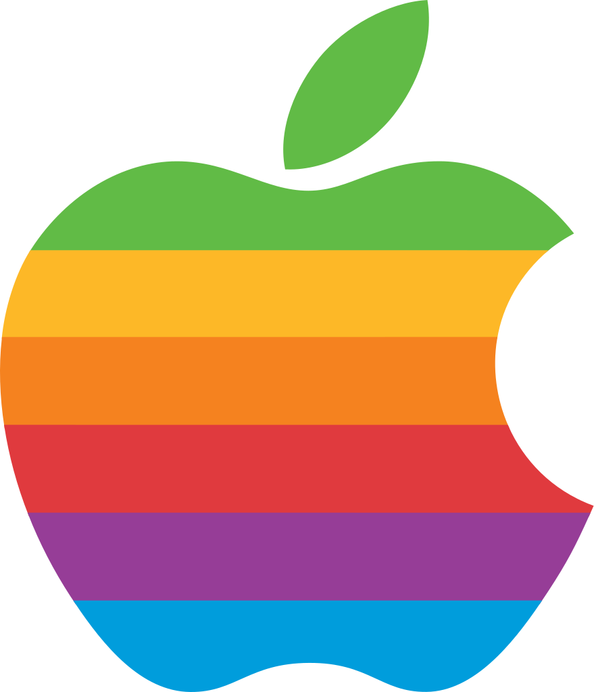
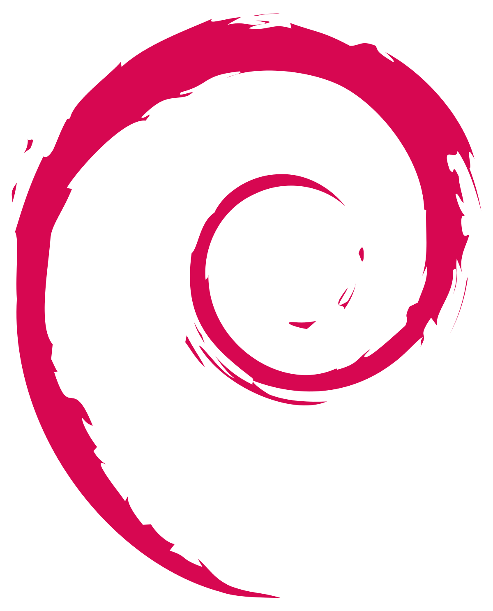

# [MQ3T](https://mq3t.guillaumechx.dev)

[//]: # (![https://img.shields.io/badge/Release-working%20on%20it%20!!-red]&#40;https://img.shields.io/badge/Release-working%20on%20it%20!!-red&#41;)
[](https://github.com/ChxGuillaume/MQ3T/releases)
[](https://github.com/ChxGuillaume/MQ3T/releases)


|  |  |
|-----------------------------------------------------------------|------------------------------------------------|
|                  |  |

### MQ3T is a MQTT client for Windows, macOS and Linux.

It allows you to visualize your MQTT topics, subscribe to them and publish messages.

You can simplify your development processes by using the built-in actions.

# Download
|                                       |                                   |                                          |                               |
|:-------------------------------------------------------------------------------------------------:|:-------------------------------------------------------------------------------------------:|:--------------------------------------------------------------------------------------------------:|:----------------------------------------------------------------------------------------:|
| [Windows Portable](https://mq3t.guillaumechx.dev/download.html?os=windows&arch=x64&type=portable) | [Mac Apple Silicon](https://mq3t.guillaumechx.dev/download.html?os=mac&arch=arm64&type=dmg) |  [AppImage (x64)](https://mq3t.guillaumechx.dev/download.html?os=linux&arch=amd64&type=AppImage)   |  [Deb (x64)](https://mq3t.guillaumechx.dev/download.html?os=linux&arch=amd64&type=deb)   |
|    [Windows Setup](https://mq3t.guillaumechx.dev/download.html?os=windows&arch=x64&type=setup)    |      [Mac Intel](https://mq3t.guillaumechx.dev/download.html?os=mac&arch=x64&type=dmg)      | [AppImage (arm64)](https://mq3t.guillaumechx.dev/download.html?os=linux&arch=arm64&type=AppImage)  | [Deb (arm64)](https://mq3t.guillaumechx.dev/download.html?os=linux&arch=arm64&type=deb)  |
|                                                                                                   |                                                                                             | [AppImage (armv7)](https://mq3t.guillaumechx.dev/download.html?os=linux&arch=armv7l&type=AppImage) | [Deb (armv7)](https://mq3t.guillaumechx.dev/download.html?os=linux&arch=armv7l&type=deb) |


## Project Setup

### Install dependencies

```bash
npm ci
```

### Development

```bash
npm run dev
```

# Project Structure

- `build/` - Build resources
- `resources/` - Static application resources
- `src/` - Main application source code
  - `main/` - Main process source code
  - `preload/` - Preload process source code (used to communicate between main and renderer process)
  - `renderer/` - Renderer process source code
    - `src/` - Vue.js source code
      - `assets/` - Static assets
      - `components/` - Vue.js components
      - `store/` - Pinia store
      - `tabs/` - Application tabs
      - `App.vue` - Vue.js root component
      - `main.ts` - Vue.js entrypoint
    - `types/` - TypeScript types

## Build

```bash
# For windows
npm run package:win

# For macOS
npm run package:mac

# For Linux
npm run package:linux
```

# License
[](https://www.tldrlegal.com/license/gnu-general-public-license-v3-gpl-3)

[GPL-3.0 License](LICENSE)
